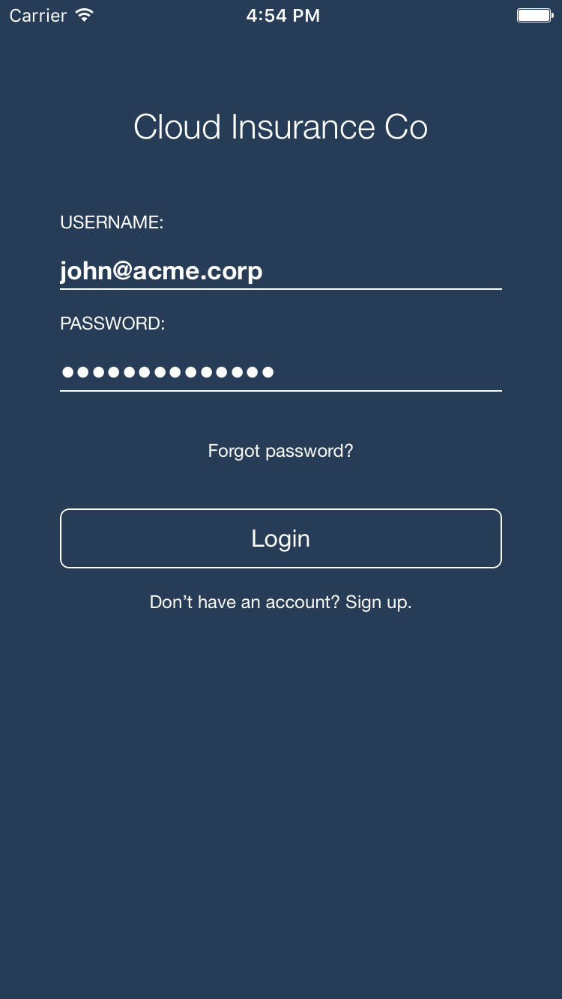

# Cloud Insurance Co. - iOS client

[](https://travis-ci.org/IBM-Bluemix/insurance-bot-ios)

This service is part of the larger [Cloud Insurance Co.](https://github.com/IBM-Bluemix/cloudco-insurance) project.

# Overview

A native iOS app to interact with the chat bot integrated in the [Cloud Insurance Co.](https://github.com/IBM-Bluemix/cloudco-insurance) application.




## Application Requirements

* XCode 8.0, iOS 10, Swift 3
* [Carthage dependency manager](https://github.com/Carthage/Carthage/releases)

## Running the application with the iOS simulator

1. The iOS app depends on the [Cloud Insurance Bot app](https://github.com/IBM-Bluemix/insurance-bot). Make sure to deploy this app first. The simpler path to deploy this app is to use the [Cloud Insurance toolchain](https://github.com/IBM-Bluemix/insurance-toolchain).

1. Ensure Carthage is installed in your environment. You can get the latest release [here](https://github.com/Carthage/Carthage/releases).

1. Clone the app to your local environment from your terminal using the following command:

  ```
  git clone https://github.com/IBM-Bluemix/insurance-bot-ios.git
  ```

  * or Download and extract the source code from [this archive](https://github.com/IBM-Bluemix/insurance-bot-ios/archive/master.zip)

1. Change to the checkout directory

  ```
  cd insurance-bot-ios
  ```

1. Get the dependencies

  ```
  carthage bootstrap --platform iOS --no-use-binaries
  ```

1. Open XCode project `insurance-mobile.xcodeproj`

1. Edit `insurance-mobile/configureMe.plist` and replace the `default_api_host` property with the location where you deployed the `insurance-bot` app.

1. Run the app

## License

See [License.txt](License.txt) for license information.
